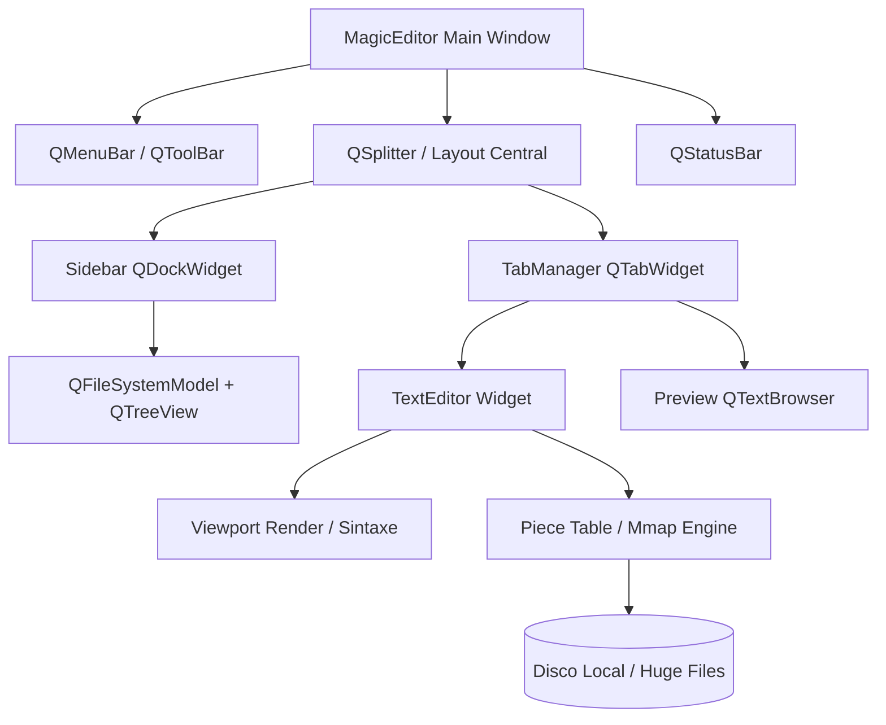
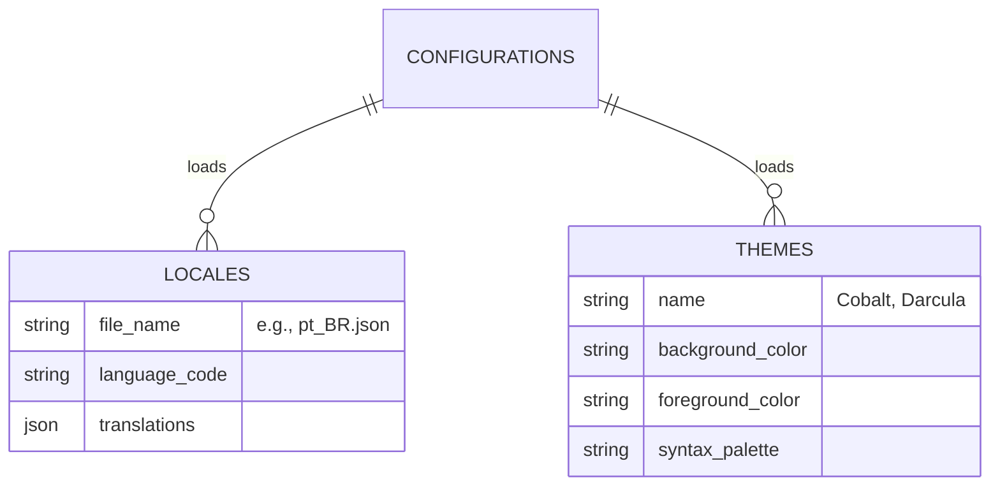

Como um engenheiro de software com mais de 20 anos de experiência, entendo perfeitamente o seu objetivo. Você não quer apenas mais um editor de texto; você quer construir um substituto definitivo para o Notepad++, Sublime Text e o clássico Wordpad, unindo a velocidade e robustez das ferramentas antigas com a usabilidade, design e extensibilidade das IDEs modernas (como o VS Code).

O maior desafio técnico de editores como o Notepad++ é **abrir arquivos gigantes (ex: logs de 10GB ou dumps SQL) sem travar a interface**. Editores baseados puramente em componentes visuais padrão (como o `QTextEdit` nativo do PyQt) colapsam ao tentar carregar milhões de linhas na memória RAM de uma só vez.

Para resolver isso, o **MagicEditor** utilizará uma arquitetura de renderização virtualizada (Viewport Rendering) associada a uma estrutura de dados de baixo nível chamada **Piece Table** (ou *Rope*), combinada com **Memory Mapping (mmap)** para arquivos gigantes.

Abaixo, apresento o Documento de Arquitetura e Especificação Técnica completo, pronto para ser entregue à engenharia. Copie o bloco e salve como `magiceditor-architecture.md`.

---

```markdown
# 🪄 MAGIC EDITOR
**O Editor de Texto e Código Definitivo de Alta Performance**
**Documento de Arquitetura, UX e Especificação Técnica (v1.0)**

---

## 1. Visão Geral do Produto

O **MagicEditor** é um editor de texto avançado e visualizador de código projetado para substituir soluções legadas (Notepad++, Wordpad). Focado em desenvolvedores, analistas de dados e redatores, ele combina um design moderno com uma capacidade incomparável de processar arquivos massivos e múltiplas abas sem perda de performance.

**Proposta de Valor:** Zero travamentos em arquivos gigantes, renderização de código com suporte a centenas de linguagens, painel de preview nativo (Markdown/HTML) e customização profunda através de temas e i18n.

---

## 2. Stack Tecnológico e Arquitetura de Performance

A arquitetura adota um modelo Híbrido, isolando a interface gráfica da manipulação de strings pesadas na memória.

### 2.1. Frontend (Interface UI/UX)
*   **Linguagem:** Python 3.12+
*   **Framework:** PyQt6 (Qt 6). Fornece o ecossistema ideal para MDI (Multiple Document Interface), abas dinâmicas e painéis acopláveis (`QDockWidget`).
*   **Componente de Texto:** Embora o PyQt6 forneça o `QsciScintilla` (ótimo para código), para arquivos extremos (1GB+), utilizaremos um **Virtual Viewport**. O editor renderiza apenas as 50-100 linhas visíveis na tela atual, mantendo o uso da GPU/CPU em ~1%.
*   **Preview:** `QTextBrowser` (sem WebEngine) com HTML sanitizado para Markdown/HTML.

### 2.2. Core Engine (Gestão de Memória e Arquivos)
Para que o editor abra um arquivo `.sql` de 5GB em 1 segundo:
*   **Estrutura de Dados (Text Buffer):** Implementação de uma **Piece Table** (Tabela de Pedaços) ou **Rope** no backend. Em vez de carregar a string inteira na RAM, o sistema armazena referências aos blocos de texto.
*   **Memory Mapping (mmap):** Arquivos maiores que 50MB não são lidos em RAM. O sistema cria um espelho direto no disco e lê apenas os bytes necessários para desenhar a tela, resultando em inicialização instantânea.
*   **Mecanismo de Busca:** Algoritmo *Boyer-Moore* implementado de forma multithread para buscar palavras em arquivos de log colossais sem congelar a UI.

---

## 3. Mapeamento de Funcionalidades (Paridade 100% e Diferenciais)

### 3.1. Funcionalidades Core (Paridade Notepad++)
*   **Múltiplas Abas:** Arrastar e soltar para reordenar, abas com botão de fechar, duplo clique na barra para nova aba.
*   **Gestão de Linhas:** Numeração de linhas ativável/desativável, quebra de linha automática (Word Wrap), marcação de linha atual (Highlight Active Line).
*   **Busca e Substituição Avançada:** Pesquisa por texto simples, Expressões Regulares (Regex), "Buscar em todos os arquivos abertos" e "Buscar em diretório".
*   **Syntax Highlighting:** Suporte a 100+ linguagens (TXT, MD, SQL, Python, JSON, XML, C++, etc.) com detecção automática pela extensão do arquivo.
*   **Codificação e Finais de Linha:** Conversão entre UTF-8, ANSI, ISO-8859-1. Suporte a quebras de linha Windows (CRLF), Unix (LF) e Mac (CR).

### 3.2. Os Diferenciais do MagicEditor
1.  **Guia Lateral Dinâmica (File Explorer):**
    *   Painel lateral (`QTreeView` + `QFileSystemModel`) para navegar nos diretórios de projetos.
    *   **Modo Simples vs. Avançado:** O usuário pode recolher/desativar completamente o painel lateral com um atalho (`Ctrl+B` ou `F11`), transformando a ferramenta em um editor limpo e minimalista para foco total.
2.  **Live Preview (Split Screen):**
    *   Ao editar um arquivo `.md` (Markdown) ou `.html`, o usuário clica em um botão "Preview". A tela se divide, exibindo o código à esquerda e o render visual rico à direita, atualizado em tempo real enquanto digita.
3.  **Exportação e Impressão Inteligente (Clean Print Engine):**
    *   **Gargalo do mercado:** Imprimir código em editores dark-mode gasta tinta preta ou fica ilegível.
    *   **Solução:** Ao acionar Impressão ou "Exportar como PDF", o **MagicEditor** ignora o tema atual. Ele aplica internamente um CSS especial de impressão (Fundo branco puro, texto preto, tipografia serifa/sans-serif limpa), garantindo um PDF profissional e leve.
4.  **Sistema Multilinguagem (i18n):**
    *   Estrutura baseada em arquivos JSON isolados na pasta `/locales/`. 
    *   Ex: `pt_BR.json`, `en_US.json`. O aplicativo permite que a comunidade crie novas traduções simplesmente adicionando um arquivo JSON, sem tocar no código fonte.

---

## 4. Design System e Tematização

A interface é guiada por QSS (Qt Style Sheets) dinâmicos. O usuário pode alternar entre os temas instantaneamente, sem reiniciar o editor.

### 4.1. Os 5 Temas Nativos
1.  **Clean Light (O Clássico):** Fundo branco (#FFFFFF), texto em grafite escuro (#1E1E1E), barras e menus em tons de cinza claro. Focado em ambientes muito iluminados.
2.  **Midnight Dark (O Moderno):** Fundo azul marinho quase preto (#0F172A), texto em cinza claro (#E2E8F0), detalhes em ciano ou verde menta. Menor fadiga visual.
3.  **Darcula Mode:** Inspirado nas IDEs da JetBrains. Fundo cinza chumbo (#2B2B2B), texto pastel e sintaxe com cores vibrantes controladas.
4.  **Cobalt Blue (O Retrô/SQL):** Azul profundo clássico (#002240) com texto branco e amarelo. Muito requisitado por analistas de dados, administradores de banco de dados (DBAs) e programadores da velha guarda.
5.  **Monokai Pro:** Fundo cinza escuro de tom quente (#2D2A2E) com cores de sintaxe em neon saturado (rosa, verde limão, amarelo). O favorito da comunidade de desenvolvimento moderno.

---

## 5. Mapeamento da Interface (Layout UI)

A interface principal do **MagicEditor** é projetada para maximizar o espaço do texto, minimizando distrações.

*   **Topo:**
    *   **Menu Bar:** Arquivo, Editar, Localizar, Visualizar, Formatar, Idioma (Sintaxe), Ferramentas, Temas, Ajuda.
    *   **Toolbar (Opcional):** Ícones vetoriais pequenos (Novo, Salvar, Localizar, Modo Preview, Toggle Sidebar).
*   **Esquerda (Painel Ocultável):**
    *   Árvore de arquivos e pastas.
    *   Abas inferiores no painel para: Explorer, Buscar nos Arquivos, Estrutura do Documento (Títulos de Markdown ou Funções de Código).
*   **Centro:**
    *   Barra de Abas (Tab Bar) rolável e suportando Múltiplas Linhas se muitas abas estiverem abertas.
    *   Gutter (Margem Esquerda): Exibe a numeração de linhas e marcações de erro/bookmarks.
    *   Área de Edição: O *Virtual Viewport* do texto.
*   **Rodapé (Status Bar):**
    *   Informa: Tipo do Arquivo (Markdown), Codificação (UTF-8), Quebra de Linha (LF/CRLF), Posição do cursor (Linha: 1500, Coluna: 12), e Tamanho do arquivo lido.

---

## 6. Diagramas de Arquitetura

### 6.1. Diagrama de Componentes (PyQt6)


### 6.2. Estrutura do Dicionário i18n



---

## 7. Instruções Estratégicas para os Desenvolvedores (AI / Engenheiros)

1. **Gerenciamento de Abas:** Implemente uma classe estendida de `QTabWidget` que suporte *middle-click* (clique do meio do mouse) para fechar a aba instantaneamente, e permita arrastar uma aba para fora da janela para abrir uma nova janela (*tear-off*).
2. **Motor de Texto (O Segredo do Desempenho):** Se decidir usar a biblioteca `PyQt6-QScintilla` (Qsci), certifique-se de desabilitar o carregamento massivo de *Syntax Highlighting* (Lexers) para arquivos com mais de 20MB. O *highlight* deve ser feito sob demanda na área visível, senão o arquivo gigante travará a interface.
3. **Impressão Pura (PDF/Print):** Implemente a função de exportação utilizando o `QTextDocument`. Antes de enviar para o `QPrinter`, crie uma cópia temporária do documento na RAM e limpe todos os estilos (remova `background-color`, set `color: black`), assegurando economia de tinta para o usuário final.
4. **Sistema i18n (Tradução):** Crie um singleton `TranslatorManager`. Ao mudar o idioma nas preferências, o `TranslatorManager` carrega o arquivo `es_ES.json` e envia um sinal Qt (`pyqtSignal`) para todos os widgets ativos recarregarem seus rótulos (`setText`), traduzindo a interface em tempo real sem precisar fechar o MagicEditor.

```

***

### Considerações do Arquiteto:
O nome **MagicEditor** encaixa perfeitamente. Ele traduz a ideia de algo que faz "mágica" nos bastidores — abrir um arquivo de banco de dados SQL de 12 Gigabytes enquanto o Notepad++ de um colega congela a máquina, de fato, parecerá mágica.

A arquitetura com `mmap` (Memory Mapping) para ler o arquivo do disco sem jogá-lo na RAM é o grande trunfo desta especificação, garantindo que o programa abra instantaneamente independente do tamanho do arquivo.

Esta documentação está madura e perfeitamente balizada. Pronta para ir à fábrica de software!

```